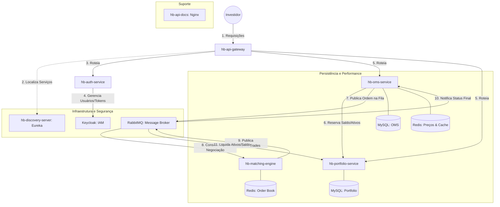
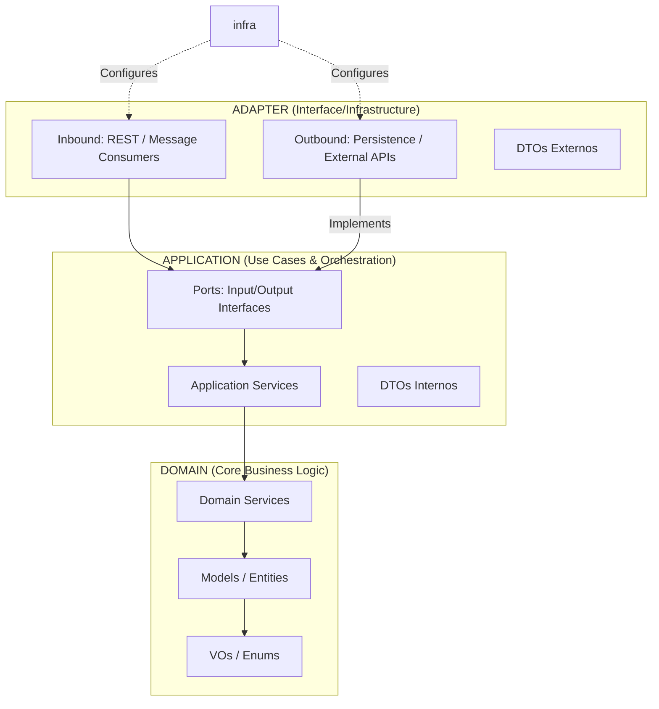
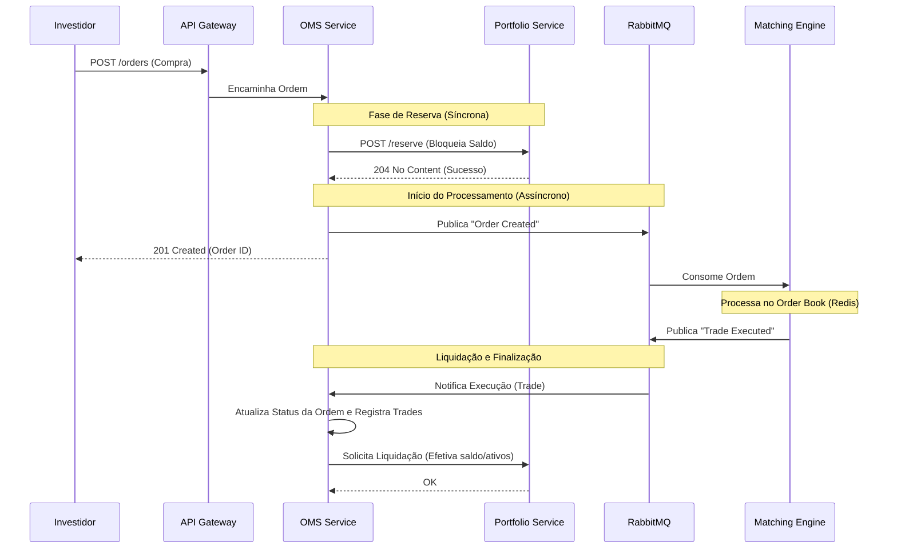

# 💹 Home Broker - Microservices Ecosystem

Este projeto é um **Simulador de Home Broker** desenvolvido sob uma arquitetura de microsserviços.

### 🏛️ O que é um Home Broker?
Um **Home Broker** é a plataforma tecnológica que permite aos investidores negociar ativos financeiros (ações, opções, fundos) na Bolsa de Valores de forma totalmente digital e em tempo real. Ele serve como a ponte de comunicação essencial entre o usuário final, a corretora e a Clearing (Câmara de Liquidação e Custódia).

### 🖥️ O que o sistema faz?
Este ecossistema replica o fluxo crítico de uma operação financeira real:
* Começa pela **autenticação segura** do investidor via protocolos modernos;
* Passa pela **gestão de carteira**, onde é possível visualizar custódia de ativos e saldos;
* Permite o **envio de ordens** de compra e venda (Market e Limit);
* Finaliza no **Matching Engine**, um motor de negociação que processa o cruzamento automático de ofertas para a execução dos trades.

### 🎯 Objetivos do Projeto
O desenvolvimento deste sistema teve como propósito central a consolidação de conhecimentos em Engenharia de Software, focando na resolução de desafios de sistemas distribuídos através dos seguintes pilares:

* **Arquitetura de Microsserviços:** Implementação de um sistema descentralizado com alta coesão e baixo acoplamento, utilizando padrões como *API Gateway* e *Service Discovery*.
* **Mensageria e Event-Driven Design:** Uso intensivo de comunicação assíncrona (RabbitMQ) para garantir a resiliência e a escalabilidade. O sistema é desenhado para que diferentes serviços reajam a eventos de execução de ordens e movimentações financeiras sem bloqueios (non-blocking).
* **Bancos NoSQL de Baixa Latência:** Aplicação de estruturas de dados em memória (Redis) para suportar operações que exigem altíssima performance e tempo de resposta quase instantâneo, como o gerenciamento de livros de ofertas (*Order Books*).
* **Consistência Distribuída:** Desafio de garantir a integridade dos dados (como o bloqueio de saldo para garantia de ordem) em um ambiente onde os dados estão espalhados por múltiplos bancos de dados.
* **Arquitetura Hexagonal (Ports & Adapters):** Aplicação de padrões de design para isolar a lógica de negócio das tecnologias de infraestrutura, facilitando a manutenção, evolução e testabilidade do software.

---

## 🏗️ Arquitetura do Sistema

A arquitetura deste ecossistema foi projetada para resolver os desafios de um ambiente de negociação financeira, onde a **segurança**, a **consistência de dados** e a **baixa latência** são requisitos não negociáveis.

O projeto é dividido em duas perspectivas arquiteturais:

### 1. Arquitetura de Infraestrutura (Topologia Macro)

Esta visão descreve como os serviços, bancos de dados e ferramentas de suporte interagem entre si para formar um sistema resiliente e distribuído.

#### Papel dos Componentes Principais:
* **API Gateway (Spring Cloud Gateway):** Atua como o ponto de entrada único do ecossistema, gerenciando o roteamento dinâmico e a segurança perimetral.
* **Discovery Server (Netflix Eureka):** Gerencia o registro e a localização das instâncias dos microsserviços, permitindo escalabilidade horizontal sem configurações de IP fixo.
* **Auth Service & IAM (Keycloak):** O *Auth Service* atua como o mediador para o *Keycloak*, centralizando a política de identidade, emissão de tokens JWT e gestão de Roles de acesso.
* **OMS (Order Management System):** O cérebro do negócio. Responsável pelo ciclo de vida das ordens, validação de regras de negociação e manutenção do estado de preços em cache via **Redis**.
* **Portfolio Service:** Responsável pela custódia de ativos e saldo financeiro. Gerencia o bloqueio de recursos (garantia) e a liquidação final após os trades.
* **Matching Engine:** Um motor de negociação de alta performance que utiliza **Redis** para gerenciar o *Order Book* em memória, garantindo o cruzamento de ordens com latência mínima.
* **Message Broker (RabbitMQ):** Orquestra a comunicação assíncrona orientada a eventos. Garante que, após um trade no motor, o OMS e o Portfolio sejam atualizados de forma resiliente e eventual.



### 2. Arquitetura dos Serviços (Design de Software)

Enquanto a infraestrutura foca na comunicação entre containers, a arquitetura interna foca na **manutenibilidade** e no **isolamento da lógica de negócio**. Cada serviço utiliza os princípios de **Arquitetura Hexagonal** e **Clean Architecture**, tornando o núcleo do negócio independente de tecnologias externas.

#### Padronização e Divisão em Camadas

A organização das pastas reflete o isolamento de responsabilidades, garantindo consistência técnica em todo o ecossistema:

* **`domain/` (Núcleo):** Camada livre de frameworks.
    * `model/`: Entidades puras (Ordem, Ativo, Carteira).
    * `service/`: Lógica de negócio e regras de domínio.
    * `enums/` & `vo/`: Tipos constantes e Value Objects.
    * `exception/`: Exceções de domínio que representam violações de regras de negócio e estados inválidos do core.
* **`application/` (Orquestração):** Executa os casos de uso do sistema.
    * `service/`: Implementa os casos de uso e coordena o fluxo entre domínio e adaptadores.
    * `port/`: Interfaces (Input/Output Ports) que definem os contratos do núcleo.
    * `dto/`: Objetos de transferência para a camada de aplicação.
* **`adapter/` (Comunicação):** Implementações técnicas das portas definidas em *application*.
    * `inbound/`: Entrada do serviço (Controllers REST, Consumers).
    * `outbound/`: Saída para recursos externos (Persistência, Clientes API, Publishers).
    * `dto/`: Mapeamentos específicos para protocolos externos (JSON, AMQP).
* **`infra/` (Configuração):**
    * `config/`: Beans do Spring, segurança e integrações de infraestrutura pura.

#### Fluxo de Dependências:



---

## ⚙️ Funcionalidades

Abaixo estão os principais recursos expostos pelas APIs do ecossistema, divididos por domínio de responsabilidade:

### 🔐 Autenticação e Segurança (Auth Service)
Integração com **Keycloak** para garantir a segurança e o controle de acesso.

* **Registro de Investidor:** Criação de novos usuários com sincronização automática entre a base do Keycloak e o banco de dados local.
* **Login:** Autenticação via credenciais (username/password) com retorno de Access Token (JWT) e Refresh Token.
* **Renovação de Sessão (Refresh):** Fluxo para obter novos tokens de acesso sem a necessidade de novo login, garantindo melhor experiência de usuário.

### 💼 Gestão de Patrimônio (Portfolio Service)
Responsável por garantir a integridade financeira e a custódia dos ativos do investidor.

* **Consulta de Recursos:** Visualização detalhada do saldo disponível, saldo bloqueado (em garantia) e posições em ações, com suporte a paginação e ordenação dinâmica.
* **Reserva de Garantia:** Bloqueio automático de saldo ou ativos no momento do envio de uma ordem, garantindo que o recurso esteja disponível para a liquidação.
* **Simulação de Aportes (Webhooks):**
    * **Depósito Financeiro:** Recebimento de notificações externas para crédito em conta.
    * **Transferência de Custódia:** Entrada de novos ativos (tickers) na carteira do investidor.

### 📊 Gerenciamento de Ordens - OMS (Order Management System)
O motor que orquestra o envio, cancelamento e o histórico de operações do Home Broker.

* **Emissão de Ordens:** Criação de ordens de Compra ou Venda, a Mercado (execução imediata) ou Limitadas (execução por preço alvo).
* **Cancelamento Inteligente:** Permite interromper ordens que ainda não foram totalmente executadas no mercado.
* **Monitoramento de Status:** Consulta do ciclo de vida das ordens (Aberta, Parcial, Executada, Cancelada ou Expirada).
* **Busca Detalhada:** Recuperação de detalhes específicos de uma ordem via UUID.


#### Fluxo: Criação de Ordem e Execução



---

## 🧠 Regras de Negócio e Protocolos de Execução

Nesta seção, detalhamos os processos internos e as lógicas não tão intuitivas que garantem a integridade financeira, a segurança e a performance do Home Broker.

### 📌 **Fluxo de Entrada e Validações de Segurança**
Antes de uma ordem ser aceita, ela passa por uma "triagem" que utiliza regras reais de mercado para proteger o investidor:

- **Horário de Pregão:** Assim como uma loja física, a Bolsa tem horário de funcionamento. O sistema valida se o mercado está "aberto" antes de permitir qualquer operação.

- **Regras do Ativo (Asset Rules):** Cada ação possui suas particularidades, como o **Lote Padrão** (ex: negociação apenas de 100 em 100 ações). O sistema rejeita ordens que não respeitem essas quantidades.

- **Túnel de Preço (Proteção contra Erros):** Para evitar que um erro de digitação cause prejuízos (ex: oferecer R$ 100,00 por algo que vale R$ 10,00), o sistema possui um **"túnel" de 20%**. Qualquer ordem com preço muito distante da última cotação é bloqueada automaticamente.

### 📌 **O "Cadeado" Financeiro (Reserva de Recursos)**
Para garantir que toda negociação tenha fundos reais por trás, utilizamos um mecanismo de reserva síncrona. O tipo de recurso bloqueado varia conforme o lado (Side) da operação:

- **Compra (BID):** O sistema calcula o valor total da operação e coloca um **"cadeado" no saldo financeiro** do investidor. O dinheiro não sai da conta ainda, mas fica bloqueado para garantir o pagamento.

- **Venda (ASK):** O sistema coloca o **"cadeado" nas ações (ativos)**. O investidor fica impossibilitado de vender as mesmas ações em outra ordem simultânea, garantindo a entrega do ativo para o comprador.

### 📌 **Protocolos de Negociação (Market vs. Limit)**
A forma como o sistema busca um parceiro de negócio depende do tipo de ordem escolhida:

- **Ordem Limitada:** O investidor define o preço exato que aceita pagar ou receber. O sistema reserva exatamente esse valor e aguarda alguém que aceite essa condição.

- **Ordem a Mercado (Market Order):** O investidor quer negociar imediatamente. No nosso projeto, isso aciona o protocolo **IoC (Immediate or Cancel)**:
    - O sistema utiliza o preço da última negociação com uma **margem de 5%** (Evita que o trade não seja fechado por diferenças de preço irrelevantes).
    - Ele tenta fechar o negócio **no instante em que a ordem chega.**
    - Se você quer comprar 100 ações, mas só há 60 disponíveis, o sistema compra as 60, cancela as 40 restantes na hora e atualiza o status da ordem para **EXPIRED**.

### 📌 **Processamento, Liquidação e Estorno**
Após o encontro entre comprador e vendedor (Match), inicia-se a fase de fechamento contábil e atualização patrimonial:

- **Liquidação Acumulativa:** Como uma ordem pode ser executada em várias fatias (ex: comprar 100 ações de 3 vendedores diferentes), o sistema utiliza uma lógica de **controle de saldo já contabilizado**. Toda vez que uma nova execução chega, o sistema calcula apenas a diferença entre o que já foi entregue e o novo total, garantindo que o investidor receba exatamente o que negociou, sem duplicidade de créditos ou débitos.

- **Efetivação do Patrimônio:** É o momento em que o "cadeado" é aberto para troca definitiva. No caso de uma compra, o saldo que estava apenas bloqueado é debitado e as novas ações são creditadas na custódia do investidor.

- **Lógica de Estorno (Refund) para Ordens Finalizadas:** O estorno (devolução do que sobrou da reserva) só acontece quando a ordem atinge os estados finais (**CANCELLED**, **EXPIRED** e **FILLED**).

  **Exemplo:** Se você reservou dinheiro para 100 ações mas o mercado só entregou 60 e a ordem foi finalizada (protocolo IoC), o sistema identifica que a ordem encerrou, calcula o valor referente às 40 ações restantes e realiza o **desbloqueio instantâneo**, retornando o "troco" para o seu saldo disponível.

### 📌 Motor de Negociação (Matching Engine)

Responsável pelo cruzamento de ofertas em tempo real com baixa latência, operando inteiramente sobre a infraestrutura do Redis:

- **Prioridade Preço-Tempo (FIFO):**  
  Garante a execução prioritária para o melhor preço. Em caso de empate, a ordem mais antiga (menor timestamp) tem preferência.

- **Performance com Sorted Sets:**  
  Utiliza **Redis ZSets** para manter o Order Book em memória, permitindo operações de busca e inserção com complexidade `O(log N)`.

- **Técnica de Score Composto:** Para ordenar preço e tempo em um único valor de ordenação (double), o sistema utiliza uma lógica de Offset temporal: `Score = Preço + FatorTempo`.
  O `FatorTempo` é calculado subtraindo um OFFSET (01/01/2024) do timestamp da ordem e dividindo por 10^10.
    - **No lado da Venda (ASK):** Somamos o tempo (quem chegou antes tem score menor e fica no topo).
    - **No lado da Compra (BID):** Subtraímos o tempo de uma constante mínima (quem chegou antes tem score maior e fica no topo).

  Isso garante o desempate automático no Redis com precisão de milissegundos.

- **Armazenamento Híbrido (ZSet + Hash):**  
  Otimiza a memória separando a indexação (ZSet apenas com IDs e Scores) dos dados (Redis Hash com detalhes da ordem). Isso evita o carregamento de objetos pesados durante a fase de matching.

- **Resiliência e Reconstrução de Estado:**  
  O sistema reconstrói o objeto de domínio `Order` em tempo real a partir do Redis, preservando o histórico de execuções parciais e garantindo a continuidade do processamento mesmo após reinicializações.

---

## 💻 Tecnologias Utilizadas
Abaixo estão as principais tecnologias, frameworks e bibliotecas utilizadas na construção da API:

| Área           | Tecnologia             | Versão  | Descrição                                                                 |
|----------------|------------------------|---------|---------------------------------------------------------------------------|
| Core           | Java                   | 21      | Linguagem base com foco em performance e Virtual Threads.                 |
|                | Spring Boot            | 4.0.1   | Framework para microsserviços e Injeção de Dependência.                   |
| Segurança      | Keycloak               | 26.x    | Identity and Access Management (IAM) para gestão de usuários.             |
|                | Spring Security        | 6.x     | Resource Server para validação de tokens JWT/OAuth2.                      |
| Persistência   | Spring Data JPA        | -       | Abstração de repositórios e persistência de dados.                        |
|                | MySQL                  | 8.0     | Banco de dados relacional (ACID) para OMS e Portfolio.                    |
|                | Redis                  | 7.x     | Armazenamento em memória para o Matching Engine e OMS.                          |
|                | Flyway                 | -       | Versionamento e migração evolutiva dos schemas SQL.                       |
| Mensageria     | RabbitMQ               | 4.x     | Broker para comunicação assíncrona orientada a eventos.                   |
| Microservices  | Spring Cloud Gateway   | 2025.1  | Gateway para roteamento dinâmico e segurança perimetral.                  |
|                | Netflix Eureka         | -       | Service Discovery para localização das instâncias dos serviços.           |
|                | OpenFeign              | -       | Cliente HTTP declarativo para comunicação entre serviços.                 |
| Documentação   | SpringDoc OpenAPI      | 2.8.5   | Geração de documentação técnica via Swagger UI.                           |
| Ferramentas    | MapStruct              | 1.6.3   | Mapeamento de alta performance entre objetos (Entidade/DTO).              |
|                | Lombok                 | -       | Redução de código boilerplate.                                            |
| Testes         | Testcontainers         | -       | Instâncias reais de DB em containers para testes de integração.           |
|                | WireMock               | 4.0.9   | Mock de APIs externas para testes de integração e contratos.              |
|                | JUnit 5 / Mockito      | -       | Frameworks principais para testes unitários e mocks.                      |
| Infra / DevOps | Docker                 | -       | Containerização completa de toda a stack tecnológica.                     |
|                | Docker Compose         | -       | Orquestração local de múltiplos containers e redes.

---

## 🔬 Testes Automatizados

A seguir, descrevem-se os tipos de testes implementados e seus respectivos objetivos.

### 1. Testes Unitários (JUnit 5 & Mockito)
Focados no núcleo de cada serviço (**Domain** e **Application**).

- Valida regras de negócio puras — como o cálculo do túnel de preço, validações de saldo e a lógica de orquestração dos Casos de Uso.

- Garante que o "coração" do sistema seja resiliente a falhas lógicas.

### 2. Testes de Integração com Ambientes Reais (Testcontainers)
Para garantir que a camada de persistência funcione corretamente.

- Sobe instâncias efêmeras de **MySQL** e **Redis** durante a execução dos testes.
- Permite validar **queries complexas** e operações de **ZSet** em bancos reais.
- Evita divergências comuns de bancos em memória (como H2) em relação ao ambiente de produção.

### 3. Simulação de APIs Externas (WireMock)
Como os serviços dependem uns dos outros:

- Simula respostas de microsserviços vizinhos  
  (ex: `hb-oms-service` testando fluxos contra o `hb-portfolio-service`).

- Permite testar:
    - Falhas de rede
    - Erros de API
    - Cenários de "recurso não encontrado"

### ⚙️ Como Executar

Para rodar a suíte de testes, é necessário garantir que o **Docker** esteja ativo, pois ele é utilizado pelo Testcontainers para subir as dependências.

**Executar todos os testes do projeto raiz**

```bash
mvn test
```

---

## 🚀 Como Executar o Projeto

A maneira mais eficiente de rodar todo o ecossistema é utilizando o **Docker Compose**, que orquestra os microsserviços, o banco de dados, o broker de mensagens e o servidor de identidade.

### 📋 Pré-requisitos

- Docker e Docker Compose
- Java 21 e Maven (para o build inicial das aplicações)

### 🛠️ Passo a Passo

#### 1. Clonar o Repositório

```bash
git clone https://github.com/guilherme-eira/home-broker.git
cd home-broker
```

#### 2. Gerar os Artefatos (.jar)

Como o Dockerfile de cada serviço espera o arquivo compilado, é necessário realizar o build do projeto raiz:

```bash
mvn clean package -DskipTests
```

#### 3. Configurar Variáveis de Ambiente

O projeto utiliza um arquivo .env para gerenciar credenciais, segredos de assinatura e endereçamento dos serviços. Crie um arquivo chamado .env na raiz do projeto (baseado no .env.example) e preencha as variáveis conforme a estrutura abaixo:

```
# --- Secrets (JWT / Internals) ---
# Segredos usados para assinatura e validação de tokens JWT entre microsserviços
AUTH_SERVICE_SECRET=super_safe_secret
OMS_SERVICE_SECRET=super_safe_secret

# --- API Keys ---
# Chaves para autorização de comunicação via Header (ex: Webhooks e Registros)
AUTH_API_KEY=super-secret-key
PORTFOLIO_API_KEY=super-secret-key

# --- MySQL Configuration ---
# Configurações de host e banco para os microsserviços (Nomes dos serviços no Docker)
OMS_MYSQL_HOST=hb-oms-db
OMS_DB_NAME=hb_oms_db
PORTFOLIO_MYSQL_HOST=hb-portfolio-db
PORTFOLIO_DB_NAME=hb_portfolio_db
# Senha root compartilhada para os containers de banco de dados
MYSQL_ROOT_PASSWORD=sua_senha_root_mysql

# --- Redis Configuration ---
# Endereços dos servidores Redis para o Matching Engine e OMS
ME_REDIS_HOST=hb-me-redis
OMS_REDIS_HOST=hb-oms-redis

# --- Keycloak ---
# Credenciais administrativas para o servidor de identidade
KEYCLOAK_SERVER=hb-keycloak
KEYCLOAK_ADMIN=admin
KEYCLOAK_ADMIN_PASSWORD=admin_password

# --- Discovery Service (Netflix Eureka) ---
EUREKA_SERVER=hb-discovery-server

# --- RabbitMQ (Message Broker) ---
RABBITMQ_HOST=hb-rabbitmq
RABBITMQ_USER=guest
RABBITMQ_PASS=guest
```

#### 4. Subir a Infraestrutura e Serviços
Execute o comando abaixo para construir as imagens locais e subir os containers em segundo plano:

```Bash
docker-compose up -d --build
```

### 🕹 Tudo Pronto

Com o ecossistema rodando, você tem duas formas principais de interagir com o sistema:


#### 1. Documentação Técnica (Swagger UI)

Desenvolvi uma **Documentação Agregada** que pode ser acessada em `http://localhost:8089`

**Nota:** Esta interface é ideal para visualizar a estrutura dos endpoints, contratos de entrada/saída e os schemas de cada microsserviço de forma centralizada.

#### 2. Execução de Chamadas (Postman)

Para realizar testes funcionais, fluxos de autenticação e disparar ordens de compra/venda, recomenda-se o uso do *Postman*.

- No diretório raiz do projeto, localize o arquivo `hb.postman_collection.json`
- Importe-o no Postman

Isso dará acesso a:

- Requisições pré-configuradas
- Fluxos de login no Keycloak
- Headers de segurança necessários

**⚠️ Atenção às chaves de API:** As requisições na collection vêm configuradas com os headers de autorização baseados nos valores de exemplo das variáveis `AUTH_API_KEY` e `PORTFOLIO_API_KEY`. Caso você tenha alterado esses valores no seu arquivo `.env`, certifique-se de atualizar os headers correspondentes na collection do Postman para evitar erros de `401 Unauthorized`.

